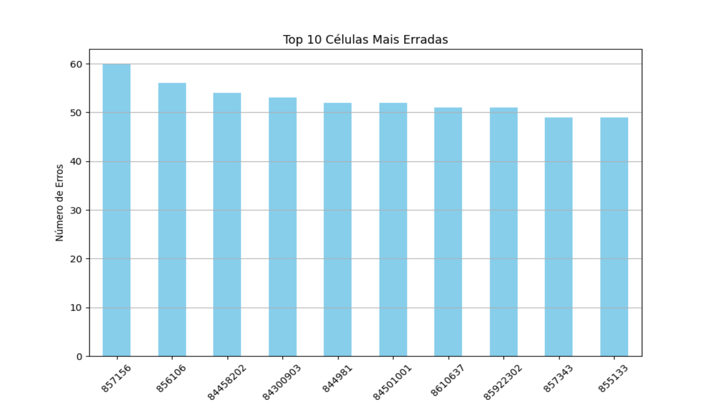

# Breast-Cancer-Cell-Prediction

## Sobre o Projeto

Este projeto foi desenvolvido como solução para um desafio do Kaggle, cujo objetivo é criar um algoritmo capaz de discernir entre células cancerígenas malignas e benignas de mama a partir de uma base de dados limitada.

A metodologia foi dividida em duas etapas principais:

    -Tratamento e Análise dos Dados: Realizado em Python para explorar e preparar um novo dataset otimizado.
    -Implementação do Algoritmo: O modelo de classificação foi desenvolvido em C com foco em eficiência.

O objetivo final era atingir uma acurácia de 90%, precisão de 90% e, crucialmente, um recall de 95%, minimizando a ocorrência de falsos negativos, pior caso possível para o diagnóstico de câncer.

## Tecnologias Utilizadas

    -Linguagem do Algoritmo: C;
    -Análise e Tratamento de Dados: Python;
    -Modelo: Regressão Logística.

## Metodologia

Para a análise dos dados, foi utilizado Python devido à sua agilidade para manipular e visualizar os dados do arquivo .csv. A abordagem inicial envolveu a criação de um dataset reduzido drasticamente, contendo metade das features originais, para comparar a performance com o modelo treinado no dataset completo. Assim, daria uma noção de maneira rápida se usar um dataset reduzido e sem redundâncias seria benéfica.

O modelo de classificação foi a Regressão Logística Binária, escolhida por sua simplicidade, interpretabilidade e forte aplicabilidade em problemas de classificação binária (Positivo vs. Negativo). A implementação em C foi uma decisão para buscar maior performance e controle sobre a manipulação do que em Python, por exemplo.

Ambos algoritmos foram executados com seeds aleatórias e testados 1000 vezes, para, além de garantir uma confiabilidade maior às métricas de precisão, recall e acurácia, também ser possível averiguar quais células eram as diagnosticadas incorretamente com maior frequência.

## Resultados

Será apresentado tanto as métricas obtidas para cada método, a matriz de confusão mediana e as células mais erradas por cada, além de suas características.

### Modelo baseado no DataSet Completo

O modelo treinado com base no dataset inteiro teve a seguinte performance:

    

A Matriz de Confusão Mediana obtida com as 1000 interações foi:

    

As células com maiores quantidades de diagnósticos errados foram:

    

### Conclusão sobre o algoritmo baseado no dataset completo

O algoritmo apresentou resultados surpreendentes se levar em consideração que havia muitas características muito redundantes e correlacionadas, podendo fazê-lo ficar tendecioso. Entretanto, o fato de que o Recall foi abaixo do esperado mostra que o dataset completo foi prejudicial ao resultado final, assim, mostrou-se ainda mais necessário fazer uma versão com o dataset enxuto. Vale mencionar que as células diagnosticadas de maneira errônea mais constantemente foram casos intermediários, entretanto o espectro foi maior se comparado ao outro algoritmo e casos de outliers também foram erroneamente diagnosticados.

### Modelo baseado no DataSet Reduzido

Por outro lado, o algoritmo treinado com o dataset reduzido teve a seguinte performance:

    

A Matriz de Confusão Mediana obtida com as 1000 interações foi:

    

As células com maiores quantidades de diagnósticos errados foram:

    

### Conclusão sobre o algoritmo baseado no dataset reduzido

O algoritmo apresentou resultados superiores em todos os quesitos em relação ao treinado baseado no dataset completo, mostrando que realmente havia overfitting de dados. Vale ressaltar que o Recall foi extremamente alto (aumento de 4,402%), mostrando que falsos negativos foram reduzidos consideravelemente, ademais o aumento marginal na acurácia e precisão se dá muito pela falta de um dataset realmente extenso para treinar o algoritmo em casos mais ambíguos, casos estes que o algoritmo com o dataset menor mais errou, outliers foram diagnosticados de maneira mais correta que o outro algoritmo.

## Considerações sobre o Projeto

O projeto foi extremamente interessante, ainda mais sobre o ponto de vista de escassez de dados para um treinamento extensivo, fazendo com que o algoritmo tivesse que ser eficiente e capaz, ademais foi um exemplo claro de overfitting e como isso afeta o resultado final. Ademais, combinações de grupos diferentes de features e números de features devem afetar amplamente o resultado final, sendo possível achar combinações que levam a um algoritmo mais robusto e preciso.
Por fim, creio que este resultado é extremamente satisfatório para o objetivo em mente e superior ao esperado.

## Códigos Disponibilizados

Tanto o código em Python quanto em C estão disponibilizados dentro da pasta docs, além de algumas informações extras. As bibliotecas necessárias também estão disponíveis no documento "requirements.txt"
